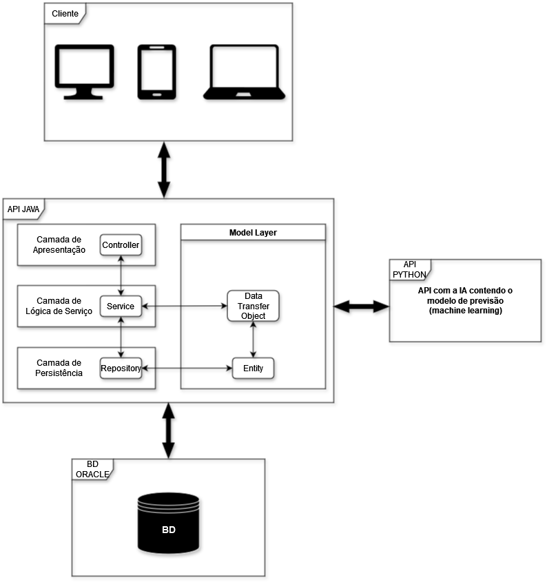

# IntelliStocks

**IntelliStocks** é uma solução inovadora de gerenciamento de inventário que utiliza aprendizado de máquina e análise de dados para antecipar demandas, otimizar estoques e automatizar reabastecimentos. Com uma interface intuitiva, oferece insights valiosos para a tomada de decisões informadas, impulsionando a eficiência operacional e a competitividade das empresas.

Confira o vídeo do pitch do nosso projeto no link abaixo:  
[Assista ao Pitch](https://youtu.be/lpCFoGbBxmY)

## Sprints

### SPRINT 1
#### Equipe:
- **Gustavo Monte (RM 551601)** - Compliance, Quality Assurance & Tests | Mobile Application Development  
- **Igor Luiz (RM 99809)** - Java Advanced | Disruptive Architectures: IoT, IoB & Generative AI
- **Lucas Lima (RM 551253)** - DevOps Tools & Cloud Computing | Disruptive Architectures: IoT, IoB & Generative AI
- **Murilo Caumo (RM 551247)** - Mastering Relational and Non-Relational Databases
- **Pedro Henrique (RM 551598)** - Advanced Business Development with .NET

### SPRINT 2
#### Equipe:
- **Gustavo Monte (RM 551601)** - Compliance, Quality Assurance & Tests
- **Igor Luiz (RM 99809)** - Java Advanced | Advanced Business Development with .NET
- **Lucas Lima (RM 551253)** - Mobile Application Development | DevOps Tools & Cloud Computing
- **Murilo Caumo (RM 551247)** - Mastering Relational and Non-Relational Databases
- **Pedro Henrique (RM 551598)** - Mastering Relational and Non-Relational Databases
- **GRUPO** - Disruptive Architectures: IoT, IoB & Generative AI

**Nota:** Embora cada membro tenha responsabilidades específicas, todos contribuem em todas as disciplinas e para o projeto como um todo.

## Arquitetura

## Diagrama

.png)

## Tarefas

- [x] CRUD Produto
- [x] CRUD TipoProduto
- [ ] CRUD Estoque
- [ ] Refatoramento
- [ ] Consumo API - Previsão de Demanda (Python)
- [ ] Autenticação de Usuário
- [ ] Relatórios
- [ ] Documentação

## Como rodar

VS Code  - Primeiramente é necessário a extenssão: Extension Pack for Java ([link](https://marketplace.visualstudio.com/items?itemName=vscjava.vscode-java-pack)) (Instruções para uso no vs code serão adicionadas)  
IntelliJ  - (Instruções para uso no intellij serão adicionadas)  
Eclipse  - (Instruções para uso no eclipse serão adicionadas)  

## Documentação da API

### Documentação feita utilizando o Swagger ([saiba mais](https://swagger.io/)).
Para acessar a documentação, basta rodar o projeto e depois navegar no seu navegador de sua preferência para: [http://localhost:8080/docs](http://localhost:8080/docs).

## Testes

### VS Code
Você pode testar a aplicação utilizando a extensão REST Client ([link](https://marketplace.visualstudio.com/items?itemName=humao.rest-client)) e fazer as requisições pelo arquivo **api.rest** na raiz do projeto.

### Postman
(Instruções para uso do Postman serão adicionadas)

### Insomnia
(Instruções para uso do Insomnia serão adicionadas)

### HTTPie
(Instruções para uso do HTTPie serão adicionadas)
