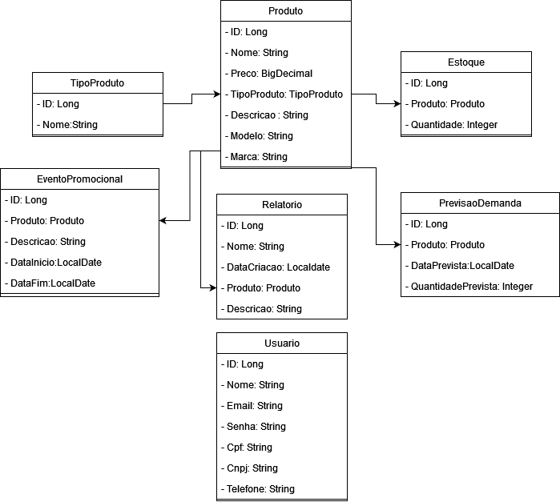

## IntelliStocks

O software IntelliStocks é uma solução inovadora de gerenciamento de inventário que utiliza aprendizado de máquina e análise de dados para antecipar demandas, otimizar estoques e automatizar reabastecimentos. Com uma interface intuitiva, oferece insights valiosos para tomada de decisões informadas, impulsionando a eficiência operacional e a competitividade das empresas. Confira o vídeo do pitch do nosso projeto no link abaixo: <br> https://youtu.be/lpCFoGbBxmY

### Após rodar o projeto teste os endpoints usando o arquivo "api.rest", disponivel ao utilizar a extensão REST CLIENT no VS CODE 

### Grupo: Gustavo Monte RM 551601, Igor Luiz RM 99809, Lucas Lima RM 551253, Murilo Caumo RM 551247 e Pedro Henrique RM 551598

## Diagrama




## Tarefas

- [x] CRUD Produto
- [ ] CRUD Estoque
- [ ] CRUD Histórico de Vendas
- [ ] CRUD Previsão de Demanda
- [ ] CRUD Evento Promocional
- [ ] Autenticação de Usuário
- [ ] Relatórios

## Documentação da API

### Endpoints

- **Listar Todos os Produtos**
  - Rota: `GET /produto`
  - Descrição: Retorna uma lista de todos os produtos cadastrados.
  - Exemplo de Resposta:
    ```json
    [
        {
            "id": 1,
            "nome": "Cerveja Puro Malte",
            "preco": 5.30,
            "tipo": "Bebidas Alcoólicas",
            "descricao": "Unidade",
            "modelo": "350ml Lata",
            "marca": "Becks"
        }
    ]
    ```
    #### Códigos de Status
    |código | descrição |
    |-------|-----------|
    | 200 | Os dados dos produtos foram retornados com sucesso
    | 401 | Acesso negado! Você deve se autenticar|
    ---

- **Obter Detalhes de um Produto**
  - Rota: `GET /produto/{id}`
  - Descrição: Retorna os detalhes de um produto específico com base no ID fornecido.
  - Exemplo de Resposta:
    ```json
    {
        "id": 1,
        "nome": "Cerveja Puro Malte",
        "preco": 5.30,
        "tipo": "Bebidas Alcoólicas",
        "descricao": "Unidade",
        "modelo": "350ml Lata",
        "marca": "Becks"
    }
    ```
    #### Códigos de Status
    |código | descrição |
    |-------|-----------|
    | 200 | Os dados dos produtos foram retornados com sucesso
    | 401 | Acesso negado! Você deve se autenticar|
    | 404 | Não existe produto com esse id
    ---

- **Cadastrar Produto**
  - Rota: `POST /produto`
  - Descrição: Cadastra um novo produto.
  - Corpo da Requisição:
    ```json
    {
        "nome": "Cerveja Puro Malte",
        "preco": 5.30,
        "tipo": "Bebidas Alcoólicas",
        "descricao": "Unidade",
        "modelo": "350ml Lata",
        "marca": "Becks"
    }
    ```
  - Exemplo de Resposta:
    ```json
    {
        "id": 1,
        "nome": "Cerveja Puro Malte",
        "preco": 5.30,
        "tipo": "Bebidas Alcoólicas",
        "descricao": "Unidade",
        "modelo": "350ml Lata",
        "marca": "Becks"
    }
    ```
    #### Códigos de Status
    |código | descrição |
    |-------|-----------|
    |201 | Dados cadastrados com sucesso
    | 400 | Dados enviados são inválidos! Verifique o corpo da requisição |
    | 401 | Acesso negado! Você deve se autenticar |
    ---
- **Editar Produto**
  - Rota: `PUT /produto/{id}`
  - Descrição: Edita as informações de um produto existente com base no ID fornecido.
  - Corpo da Requisição (passe os novos parâmetros):
    ```json
    {
        "nome": "Cerveja Puro Malte",
        "preco": 5.20,
        "tipo": "Bebidas Alcoólicas",
        "descricao": "Unidade",
        "modelo": "350ml Lata",
        "marca": "Becks"
    }
    ``` 
  - Exemplo de Resposta:
    ```json
    {
        "nome": "Cerveja Puro Malte",
        "preco": 5.20,
        "tipo": "Bebidas Alcoólicas",
        "descricao": "Unidade",
        "modelo": "1L Garrafa",
        "marca": "Becks"
    }
    ```
    #### Códigos de Status

    |código | descrição |
    |-------|-----------|
    | 200 | Barbearia editada com êxito
    | 400 | Dados envidos são inválidos. Verifique o corpo da requisição
    | 404 | Não existe barbearia com esse parâmetro |
    | 401 | Acesso negado! Você deve se autenticar | 
    ---
- **Desabilitando Produto**
  - Rota: `DELETE /produto/{id}`
  - Descrição: Remove um produto com base no ID fornecido.

    #### Códigos de Status
    |código | descrição |
    |-------|-----------|
    |204 | Produto desabilitado com êxito
    | 404 | Não existe produto com o id informado |
    | 401 | Acesso negado! Você deve se autenticar |
    ---
- **Produtos Desabilitados**
  - Rota: `GET /produto/disable`
  - Descrição: Lista os produtos desabilitados.
  - Exemplo de Resposta:
  ```json
    [
        {
            "id": 1,
            "nome": "Cerveja Puro Malte",
            "preco": 5.30,
            "tipo": "Bebidas Alcoólicas",
            "descricao": "Unidade",
            "modelo": "350ml Lata",
            "marca": "Becks",
            "ativo": false
        }
    ]
  ```

