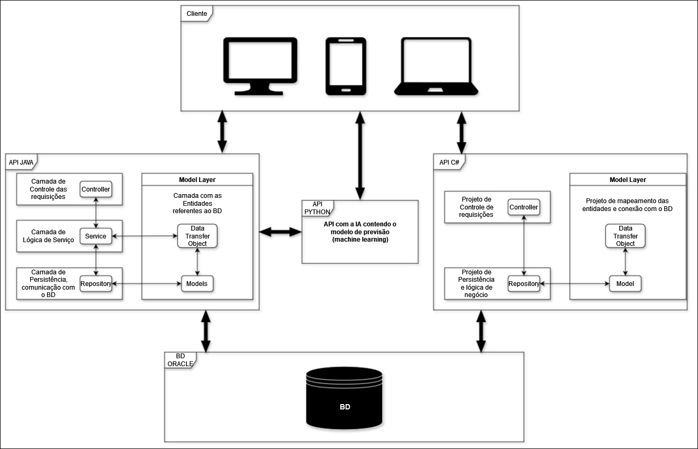
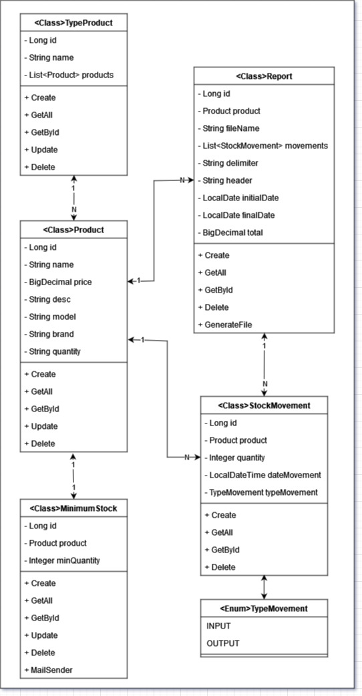

# IntelliStocks

**IntelliStocks** é uma solução inovadora de gerenciamento de inventário que utiliza **aprendizado de máquina** e **análise de dados** para antecipar demandas, otimizar estoques e automatizar reabastecimentos. Com uma **interface intuitiva**, oferece **insights valiosos** para a tomada de decisões informadas, impulsionando a **eficiência operacional** e a **competitividade** das empresas.

O projeto **IntelliStocks** não só revolucionará o gerenciamento de inventário, mas também contará com um robusto **sistema de controle de gerenciamento de empresas**. Esse sistema permitirá que empresas possam organizar suas **tarefas**, registrar **notas importantes** e agendar **eventos** de forma eficiente. A integração dessas funcionalidades garantirá que as empresas tenham uma **visão completa das operações**, desde a gestão de estoques até o planejamento estratégico, tudo em um único ambiente.

Recursos como **alertas automatizados via email** e um **painel de controle centralizado** proporcionarão ainda mais controle e organização. Dessa forma, o **IntelliStocks** se tornará uma ferramenta essencial tanto para a **gestão operacional** quanto para o **planejamento estratégico** das empresas.

### Confira o vídeo de entrega da Spring 4, contendo objetivos do projeto e :[Link do vídeo](https://youtu.be/89R75nuoB9E)

Confira o vídeo do pitch do nosso projeto no link abaixo:  
[Assista ao Pitch](https://youtu.be/lpCFoGbBxmY)

Projeto C#: [https://github.com/IgorLuiz777/IntelliStocks.NET](https://github.com/IgorLuiz777/IntelliStocks.NET)

Projeto Mobile: [https://github.com/lucasrychlicki/IntelliStocks](https://github.com/lucasrychlicki/IntelliStocks)

Projeto IA: [https://github.com/CastanhoPh/IntelliStocksAI](https://github.com/CastanhoPh/IntelliStocksAI)

## Sprints

### SPRINT 1
#### Equipe:
- **Gustavo Monte (RM 551601)** - Compliance, Quality Assurance & Tests | Mobile Application Development  
- **Igor Luiz (RM 99809)** - Java Advanced | Disruptive Architectures: IoT, IoB & Generative AI
- **Lucas Lima (RM 551253)** - DevOps Tools & Cloud Computing | Disruptive Architectures: IoT, IoB & Generative AI
- **Murilo Caumo (RM 551247)** - Mastering Relational and Non-Relational Databases
- **Pedro Henrique (RM 551598)** - Advanced Business Development with .NET

### SPRINT 2
#### Equipe:
- **Gustavo Monte (RM 551601)** - Compliance, Quality Assurance & Tests
- **Igor Luiz (RM 99809)** - Java Advanced | Advanced Business Development with .NET
- **Lucas Lima (RM 551253)** - Mobile Application Development | DevOps Tools & Cloud Computing
- **Murilo Caumo (RM 551247)** - Mastering Relational and Non-Relational Databases
- **Pedro Henrique (RM 551598)** - Mastering Relational and Non-Relational Databases
- **GRUPO** - Disruptive Architectures: IoT, IoB & Generative AI

### SPRINT 3
#### Equipe:
- **Gustavo Monte (RM 551601)** - Compliance, Quality Assurance & Tests
- **Igor Luiz (RM 99809)** - Java Advanced | Advanced Business Development with .NET
- **Lucas Lima (RM 551253)** - Mobile Application Development | DevOps Tools & Cloud Computing
- **Murilo Caumo (RM 551247)** - Mastering Relational and Non-Relational Databases
- **Pedro Henrique (RM 551598)** - Disruptive Architectures: IoT, IoB & Generative AI

### SPRINT 4
#### Equipe:
- **Gustavo Monte (RM 551601)** - Compliance, Quality Assurance & Tests
- **Igor Luiz (RM 99809)** - Java Advanced | Advanced Business Development with .NET
- **Lucas Lima (RM 551253)** - Mobile Application Development | DevOps Tools & Cloud Computing
- **Murilo Caumo (RM 551247)** - Mastering Relational and Non-Relational Databases
- **Pedro Henrique (RM 551598)** - Disruptive Architectures: IoT, IoB & Generative AI

**Nota:** Embora cada membro tenha responsabilidades específicas, 
todos contribuem em todas as disciplinas e para o projeto como um todo.

## Arquitetura - Camadas



## Diagrama



## Tarefas

- [x] CRUD Produto
- [x] CRUD TipoProduto
- [x] CRUD Movimentação
- [x] Integração com a IA
- [x] Geração de CSV
- [x] Autenticação + Usuário
- [x] Mensageria - RabbitMQ
- [ ] Refatoração
- [x] Documentação

## Como rodar
Aqui está o passo a passo para configurar o projeto **IntelliStocksApi** em diferentes IDEs e começar a trabalhar no código:
### 1. Clonar o repositório:
Abra o terminal e execute o seguinte comando para clonar o repositório:
```bash
git clone https://github.com/IgorLuiz777/IntelliStocksApi
```
Depois, navegue para a pasta do projeto:
```bash
cd ./IntelliStocksApi
```
2. Configuração em IDEs:
   VS Code 

Para usar o VS Code, primeiro instale a extensão Extension Pack for Java:

Extension Pack for Java

Siga estes passos:

- Abra o VS Code e vá para a aba de extensões (ícone de quadrados no lado esquerdo).
- Procure por "Extension Pack for Java" e instale.
- Abra o projeto IntelliStocksApi pelo VS Code: File > Open Folder > selecione a pasta IntelliStocksApi.
- O VS Code configurará automaticamente o ambiente para trabalhar com Java.

3. IntelliJ 

Para configurar no IntelliJ, siga os passos:

- Abra o IntelliJ e selecione a opção Open para abrir o projeto IntelliStocksApi.
- O IntelliJ reconhecerá automaticamente o projeto e configurará o ambiente Java.

4. Eclipse 

Para configurar no Eclipse:

- Abra o Eclipse e selecione File > Import.
- Escolha Maven > Existing Maven Projects e selecione a pasta IntelliStocksApi.
- O Eclipse configurará o projeto automaticamente.

## Documentação da API

### Documentação feita utilizando o Swagger ([saiba mais](https://swagger.io/)).
Para acessar a documentação, basta rodar o projeto e depois navegar no seu navegador de sua preferência para: [http://localhost:8080/docs](http://localhost:8080/docs).

## Testes

### Http Client
Você pode testar a aplicação utilizando uma extensão de API REST ou Http client em sua IDE. E fazer as requisições pelo 
arquivo **api.rest** na raiz do projeto.

### Postman
Link do workspace do postman - https://www.postman.com/speeding-satellite-21324/intellistocks </br>
Ou import o json 'IntelliStocks REQS - JAVA.postman_collection.json' na pasta raiz do projeto para dentro do postman
