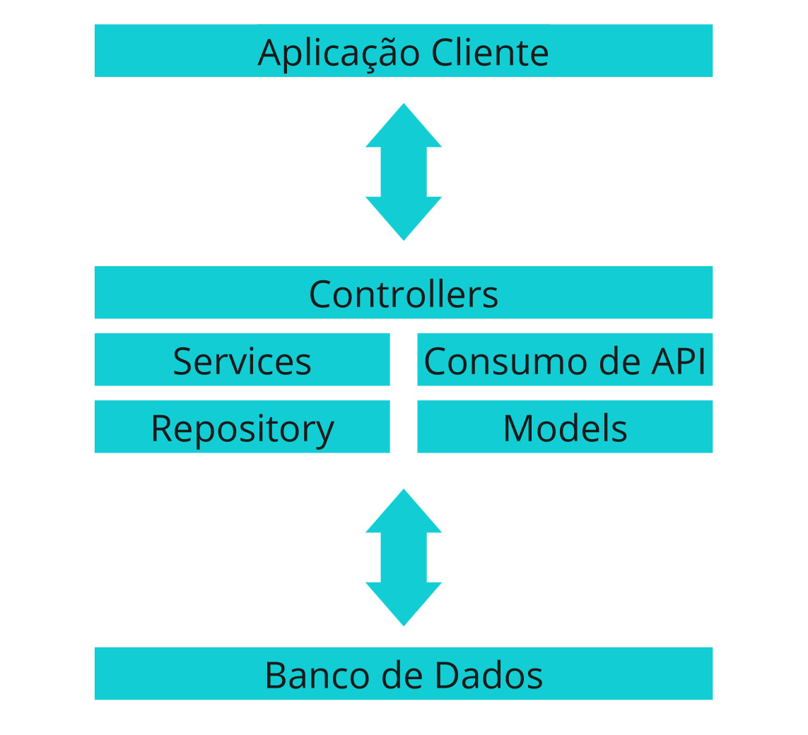

# IntelliStocks

O software IntelliStocks é uma solução inovadora de gerenciamento de inventário que utiliza aprendizado de máquina e análise de dados para antecipar demandas, otimizar estoques e automatizar reabastecimentos. Com uma interface intuitiva, oferece insights valiosos para tomada de decisões informadas, impulsionando a eficiência operacional e a competitividade das empresas. Confira o vídeo do pitch do nosso projeto no link abaixo:   https://youtu.be/lpCFoGbBxmY

## SPRINT 1:
### Gustavo Monte RM 551601 - COMPLIANCE, QUALITY ASSURANCE & TESTS | Mobile Application Development  
### Igor Luiz RM 99809 - JAVA ADVANCED | DISRUPTIVE ARCHITECTURES: IOT, IOB & GENERATIVE IA
### Lucas Lima RM 551253 - DevOps Tools & Cloud Computing | DISRUPTIVE ARCHITECTURES: IOT, IOB & GENERATIVE IA
### Murilo Caumo RM 551247 - MASTERING RELATIONAL AND NON-RELATIONAL DATABASE
### Pedro Henrique RM 551598 - ADVANCED BUSINESS DEVELOPMENT WITH .NET

### Apesar de as responsabilidades específicas estarem atribuídas a cada integrante, todos os membros do grupo contribuem em todas as disciplinas e para o projeto como um todo.

## SPRINT 2:
### Gustavo Monte RM 551601 - COMPLIANCE, QUALITY ASSURANCE & TESTS
### Igor Luiz RM 99809 - JAVA ADVANCED
### Lucas Lima RM 551253 - Mobile Application Development
### Murilo Caumo RM 551247 - MASTERING RELATIONAL AND NON-RELATIONAL DATABASE
### Pedro Henrique RM 551598 - ADVANCED BUSINESS DEVELOPMENT WITH .NET

### Apesar de as responsabilidades específicas estarem atribuídas a cada integrante, todos os membros do grupo contribuem em todas as disciplinas e para o projeto como um todo.

### DISRUPTIVE ARCHITECTURES: IOT, IOB & GENERATIVE IA
### DevOps Tools & Cloud Computing

## Arquitetura

## Diagrama

.png)

## Tarefas

- [x] CRUD Produto
- [ ] CRUD TipoProduto
- [ ] CRUD Estoque
- [ ] Consumo API - Previsão de Demanda (Python)
- [ ] Autenticação de Usuário
- [ ] Relatórios
- [ ] Documentação

## Como rodar
# TO DO

### VS Code  - Primeiramente é necessário a extenssão: Extension Pack for Java ([link](https://marketplace.visualstudio.com/items?itemName=vscjava.vscode-java-pack))
### IntelliJ  -
### Eclipse   -

## Documentação da API

### Documentação feita utilizando o Swagger ([saiba mais](https://swagger.io/)).
### Para acesssar a documentação, basta rodar o projeto e depois navegar em seu navegador de sua preferência no endereço: [http://localhost:8080/docs](http://localhost:8080/docs).

## Testes
# TO DO
### No Vs Code - Você pode testar a aplicação utilizando a extenssão REST Client ([link](https://marketplace.visualstudio.com/items?itemName=humao.rest-client)) e fazer as requisições pelo arquivo **api.rest** na raiz do projeto.

### Postman - 
### Insomnia - 
